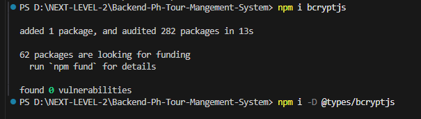
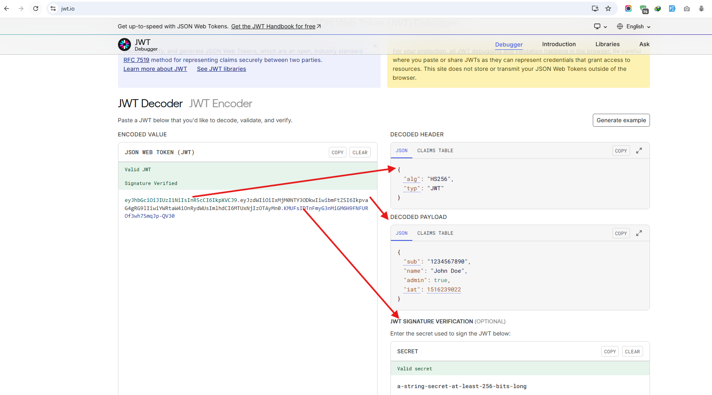
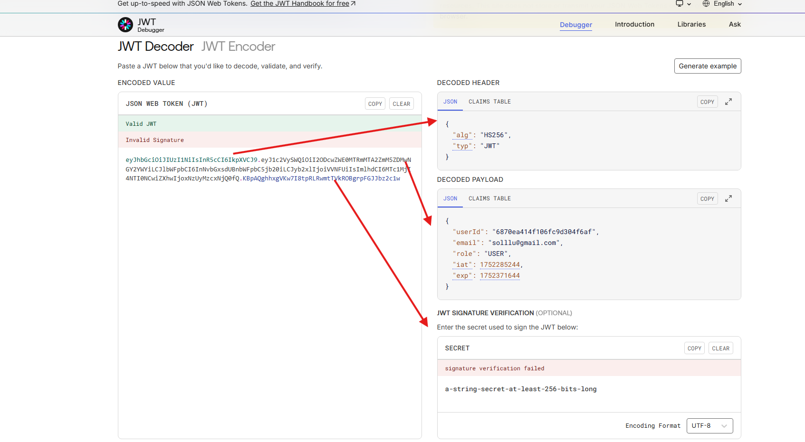

GitHub Link: https://github.com/Apollo-Level2-Web-Dev/ph-tour-management-system-backend/tree/part-2

# Ph Tour Management Backend Tour Backend Part-2
## 27-1 Create Zod Validation for User APIs
```ts
import { NextFunction, Request, Response, Router } from "express";
import { UserController } from "./user.controller";
import z from "zod";


const router=Router()

router.post("/register", async(req:Request, res:Response ,next:NextFunction)=>{
const createUserZodSchema = z.object({
  name: z.string({
    invalid_type_error: "Name must be a string",
  })
    .min(2, { message: "Name too short, minimum 2 characters" })
    .max(50, { message: "Name too long, maximum 50 characters" }),

  email: z.string().email({ message: "Invalid email address" }),

  password: z.string({
    required_error: "Password is required",
  }).regex(
    /^(?=.*[A-Z])(?=.*[!@#$%^&*])(?=.*\d).{8,}$/,
    {
      message: "Password must be at least 8 characters and include 1 uppercase letter, 1 special character, and 1 number"
    }
  ),

  phone: z.string().regex(
    /^(?:\+88|88)?01[3-9]\d{8}$/,
    {
      message: "Invalid Bangladeshi phone number"
    }
  ).optional(),

  address: z.string()
    .max(200, { message: "Address too long, maximum 200 characters" })
    .optional(),
})
req.body = await createUserZodSchema.parseAsync((req.body))
console.log(req.body)
next()

},
 UserController.createUser)


router.get("/all-users",UserController.getAllUsers)

export const UserRoutes = router 
```
## 27-1 Create Zod Validation for User APIs

- We Will Use Zod While Creating a Data and Updating a Data 
- We will create zod for those whose default values are not set by backend. 


```ts 
import { NextFunction, Request, Response, Router } from "express";
import { userControllers } from "./user.controller";
import z from "zod";

const router = Router()


router.get("/all-users", userControllers.getAllUsers)
router.post("/register",
// middleware 
    async (req: Request, res: Response, next: NextFunction) => {

        const createUserZodSchema = z.object({
            name: z
                .string({ invalid_type_error: "Name must be string" })
                .min(2, { message: "Name must be at least 2 characters long." })
                .max(50, { message: "Name cannot exceed 50 characters." }),
            email: z
                .string({ invalid_type_error: "Email must be string" })
                .email({ message: "Invalid email address format." })
                .min(5, { message: "Email must be at least 5 characters long." })
                .max(100, { message: "Email cannot exceed 100 characters." }),
            password: z
                .string({ invalid_type_error: "Password must be string" })
                .min(8, { message: "Password must be at least 8 characters long." })
                .regex(/^(?=.*[A-Z])/, {
                    message: "Password must contain at least 1 uppercase letter.",
                })
                .regex(/^(?=.*[!@#$%^&*])/, {
                    message: "Password must contain at least 1 special character.",
                })
                .regex(/^(?=.*\d)/, {
                    message: "Password must contain at least 1 number.",
                }),
            phone: z
                .string({ invalid_type_error: "Phone Number must be string" })
                .regex(/^(?:\+8801\d{9}|01\d{9})$/, {
                    message: "Phone number must be valid for Bangladesh. Format: +8801XXXXXXXXX or 01XXXXXXXXX",
                })
                .optional(),
            address: z
                .string({ invalid_type_error: "Address must be string" })
                .max(200, { message: "Address cannot exceed 200 characters." })
                .optional()
        })

        // validate using zod 

        req.body = await createUserZodSchema.parseAsync(req.body)
        console.log(req.body)
        // next()

    },

    userControllers.createUser)

export const UserRoutes = router
```

## 27-2 Implement validateRequest Middleware

- lets separate the validation 

- user.validation.ts 

```ts 
import z from "zod";

export const createUserZodSchema = z.object({
    name: z
        .string({ invalid_type_error: "Name must be string" })
        .min(2, { message: "Name must be at least 2 characters long." })
        .max(50, { message: "Name cannot exceed 50 characters." }),
    email: z
        .string({ invalid_type_error: "Email must be string" })
        .email({ message: "Invalid email address format." })
        .min(5, { message: "Email must be at least 5 characters long." })
        .max(100, { message: "Email cannot exceed 100 characters." }),
    password: z
        .string({ invalid_type_error: "Password must be string" })
        .min(8, { message: "Password must be at least 8 characters long." })
        .regex(/^(?=.*[A-Z])/, {
            message: "Password must contain at least 1 uppercase letter.",
        })
        .regex(/^(?=.*[!@#$%^&*])/, {
            message: "Password must contain at least 1 special character.",
        })
        .regex(/^(?=.*\d)/, {
            message: "Password must contain at least 1 number.",
        }),
    phone: z
        .string({ invalid_type_error: "Phone Number must be string" })
        .regex(/^(?:\+8801\d{9}|01\d{9})$/, {
            message: "Phone number must be valid for Bangladesh. Format: +8801XXXXXXXXX or 01XXXXXXXXX",
        })
        .optional(),
    address: z
        .string({ invalid_type_error: "Address must be string" })
        .max(200, { message: "Address cannot exceed 200 characters." })
        .optional()
})
```
- lets make a higher order function for the middleware. the higher order function will be will be always coupled with middleware. it will take a function inside and will return a function from inside. when we will split a middleware function in express we will use higher order because the middleware function must return a function with request response. 


- user.route.ts 

```ts 
import { NextFunction, Request, Response, Router } from "express";
import { userControllers } from "./user.controller";
import { AnyZodObject } from "zod";
import { createUserZodSchema } from "./user.validation";


const validateRequest = (zodSchema: AnyZodObject) => async (req: Request, res: Response, next: NextFunction) => {

    try {
        console.log("Old Body", req.body)
        req.body = await zodSchema.parseAsync(req.body)
        console.log("New Body", req.body)
        // here data sanitization is working. 
        // Its like if we give any unwanted fields inside body it will removed. and set the properly validated data inside body and the controller will work with it. 
        next()
    } catch (error) {
        next(error)

    }
}
// this higher order function returning a function made with req and response that is required inside the route middleware. 


const router = Router()


router.get("/all-users", userControllers.getAllUsers)
router.post("/register",
    validateRequest(createUserZodSchema),
    userControllers.createUser)

export const UserRoutes = router
```


- Now lets separate the validate request middleware to another file 
- middlewares -> validateRequest.ts 

```ts 
import { NextFunction, Request, Response } from "express"
import { AnyZodObject } from "zod"

export const validateRequest = (zodSchema: AnyZodObject) => async (req: Request, res: Response, next: NextFunction) => {

    try {
        console.log("Old Body", req.body)
        req.body = await zodSchema.parseAsync(req.body)
        console.log("New Body", req.body)
        // here data sanitization is working. 
        // Its like if we give any unwanted fields inside body it will removed. and set the properly validated data inside body and the controller will work with it. 
        next()
    } catch (error) {
        next(error)

    }
}
```

- user.route.ts 

```ts 

import { Router } from "express";
import { validateRequest } from "../../middlewares/validateRequest";
import { userControllers } from "./user.controller";

import { createUserZodSchema } from "./user.validation";


const router = Router()


router.get("/all-users", userControllers.getAllUsers)
router.post("/register",
    validateRequest(createUserZodSchema),
    userControllers.createUser)

export const UserRoutes = router
```

- basically the validateRequest middleware is helping us validate the data send in body before entering in contact with server. 

- Added Update User Validation schema 


```ts 
import z from "zod";
import { IsActive, Role } from "./user.interface";

export const createUserZodSchema = z.object({
    name: z
        .string({ invalid_type_error: "Name must be string" })
        .min(2, { message: "Name must be at least 2 characters long." })
        .max(50, { message: "Name cannot exceed 50 characters." }),
    email: z
        .string({ invalid_type_error: "Email must be string" })
        .email({ message: "Invalid email address format." })
        .min(5, { message: "Email must be at least 5 characters long." })
        .max(100, { message: "Email cannot exceed 100 characters." }),
    password: z
        .string({ invalid_type_error: "Password must be string" })
        .min(8, { message: "Password must be at least 8 characters long." })
        .regex(/^(?=.*[A-Z])/, {
            message: "Password must contain at least 1 uppercase letter.",
        })
        .regex(/^(?=.*[!@#$%^&*])/, {
            message: "Password must contain at least 1 special character.",
        })
        .regex(/^(?=.*\d)/, {
            message: "Password must contain at least 1 number.",
        }),
    phone: z
        .string({ invalid_type_error: "Phone Number must be string" })
        .regex(/^(?:\+8801\d{9}|01\d{9})$/, {
            message: "Phone number must be valid for Bangladesh. Format: +8801XXXXXXXXX or 01XXXXXXXXX",
        })
        .optional(),
    address: z
        .string({ invalid_type_error: "Address must be string" })
        .max(200, { message: "Address cannot exceed 200 characters." })
        .optional()
})

export const updateUserZodSchema = z.object({
    name: z
        .string({ invalid_type_error: "Name must be string" })
        .min(2, { message: "Name must be at least 2 characters long." })
        .max(50, { message: "Name cannot exceed 50 characters." }).optional(),
    password: z
        .string({ invalid_type_error: "Password must be string" })
        .min(8, { message: "Password must be at least 8 characters long." })
        .regex(/^(?=.*[A-Z])/, {
            message: "Password must contain at least 1 uppercase letter.",
        })
        .regex(/^(?=.*[!@#$%^&*])/, {
            message: "Password must contain at least 1 special character.",
        })
        .regex(/^(?=.*\d)/, {
            message: "Password must contain at least 1 number.",
        }).optional(),
    phone: z
        .string({ invalid_type_error: "Phone Number must be string" })
        .regex(/^(?:\+8801\d{9}|01\d{9})$/, {
            message: "Phone number must be valid for Bangladesh. Format: +8801XXXXXXXXX or 01XXXXXXXXX",
        })
        .optional(),
    role: z
        // .enum(["ADMIN", "GUIDE", "USER", "SUPER_ADMIN"])
        .enum(Object.values(Role) as [string])
        .optional(),
    isActive: z
        .enum(Object.values(IsActive) as [string])
        .optional(),
    isDeleted: z
        .boolean({ invalid_type_error: "isDeleted must be true or false" })
        .optional(),
    isVerified: z
        .boolean({ invalid_type_error: "isVerified must be true or false" })
        .optional(),
    address: z
        .string({ invalid_type_error: "Address must be string" })
        .max(200, { message: "Address cannot exceed 200 characters." })
        .optional()
})
```
## 27-3 Adding password and fix bugs for email password based User registration API

```ts 
import AppError from "../../errorHelpers/AppError";
import { IAuthProvider, IUser } from "./user.interface";
import { User } from "./user.model";
import httpStatus from 'http-status-codes';

const createUser = async (payload: Partial<IUser>) => {

    const { email, ...rest } = payload

    const isUserExist = await User.findOne({ email })

    if (isUserExist) {
        throw new AppError(httpStatus.BAD_REQUEST, "User Already Exists")
    }

    // // eslint-disable-next-line @typescript-eslint/no-non-null-assertion
    // const authProvider: IAuthProvider = {provider : "credentials", providerId : email!}


    const authProvider: IAuthProvider = { provider: "credentials", providerId: email as string }

    const user = await User.create({
        email,
        auths: [authProvider],
        ...rest
    })

    return user
}

const getAllUsers = async () => {
    const users = await User.find({})
    const totalUsers = await User.countDocuments()

    return {
        data: users,
        meta: {
            total: totalUsers
        }
    }
}

export const userServices = {
    createUser,
    getAllUsers
}
```

- update in user.interface.ts 

```ts 
import { Types } from "mongoose"

export enum Role {
    SUPER_ADMIN = "SUPER_ADMIN",
    ADMIN = "ADMIN",
    USER = "USER",
    GUIDE = "GUIDE"
}


export enum IsActive {
    ACTIVE = "ACTIVE",
    INACTIVE = "INACTIVE",
    BLOCKED = "BLOCKED"
}

// AUTH PROVIDER 

/**
 * EMAIL, PASSWORD
 * GOOGLE AUTHENTICATION
 */

export interface IAuthProvider {
    provider: "google" | "credentials";
    providerId: string

}
export interface IUser {
    name: string,
    email: string,
    password?: string,
    phone?: string,
    picture?: string,
    address?: string,
    isDeleted?: boolean,
    isActive?: IsActive,
    isVerified?: boolean,
    role: Role
    auths: IAuthProvider[],
    bookings?: Types.ObjectId[],
    guides?: Types.ObjectId[]


}
```


## 27-4 Fix sensitive password bugs, Password Hashing

- install bcryptjs

```bash
npm i bcryptjs
```

- user.service.ts password hashing

```ts 
import AppError from "../../errorHelpers/AppError";
import { IAuthProvider, IUser } from "./user.interface";
import { User } from "./user.model";
import httpStatus from 'http-status-codes';
import bcrypt from "bcryptjs";

const createUser = async (payload: Partial<IUser>) => {

    const { email, password, ...rest } = payload

    const isUserExist = await User.findOne({ email })

    if (isUserExist) {
        throw new AppError(httpStatus.BAD_REQUEST, "User Already Exists")
    }

    const hashedPassword = await bcrypt.hash(password as string, 10)
    // const isPasswordMatch = await bcrypt.compare("password as string", hashedPassword) //compares password 


    // // eslint-disable-next-line @typescript-eslint/no-non-null-assertion
    // const authProvider: IAuthProvider = {provider : "credentials", providerId : email!}


    const authProvider: IAuthProvider = { provider: "credentials", providerId: email as string }

    const user = await User.create({
        email,
        password: hashedPassword,
        auths: [authProvider],
        ...rest
    })

    return user
}

const getAllUsers = async () => {
    const users = await User.find({})
    const totalUsers = await User.countDocuments()

    return {
        data: users,
        meta: {
            total: totalUsers
        }
    }
}

export const userServices = {
    createUser,
    getAllUsers
}
```

## 27-5 Create Login API

- auth.service.ts 

```ts
import AppError from "../../errorHelpers/AppError"
import { IUser } from "../user/user.interface"
import httpStatus from 'http-status-codes';
import { User } from "../user/user.model";
import bcrypt from "bcryptjs";


const credentialsLogin = async (payload: Partial<IUser>) => {
    const { email, password } = payload

    const isUserExist = await User.findOne({ email })
    if (!isUserExist) {
        throw new AppError(httpStatus.BAD_REQUEST, "Email Does Not Exist")
    }

    const isPasswordMatch = await bcrypt.compare(password as string, isUserExist.password as string)

    if (!isPasswordMatch) {
        throw new AppError(httpStatus.BAD_REQUEST, "Password Does Not Match")
    }

    return {
        email: isUserExist.email
    }
}

export const AuthServices = {
    credentialsLogin
}
```

- auth.controller.ts 

```ts 
/* eslint-disable @typescript-eslint/no-unused-vars */
import { NextFunction, Request, Response } from "express"
import { catchAsync } from "../../catchAsync"
import { sendResponse } from "../../utils/sendResponse"
import httpStatus from 'http-status-codes';
import { AuthServices } from "./auth.service";

const credentialsLogin = catchAsync(async (req: Request, res: Response, next: NextFunction) => {
    const loginInfo = await AuthServices.credentialsLogin(req.body)

    sendResponse(res, {
        success: true,
        statusCode: httpStatus.OK,
        message: "User Logged In Successfully",
        data: loginInfo
    })
})

export const AuthControllers = {
    credentialsLogin
}
```

- auth.route.ts

```ts 
import { Router } from "express";
import { AuthControllers } from "./auth.controller";

const router = Router()

router.post("/login", AuthControllers.credentialsLogin)

export const authRoutes = router
```

-  routes-> index.ts 
  
```ts 
import { Router } from "express";
import { UserRoutes } from "../modules/user/user.route";
import { authRoutes } from "../modules/auth/auth.route";

export const router = Router()

const moduleRoutes = [
    {
        path: "/user",
        route: UserRoutes
    },
    {
        path: "/auth",
        route: authRoutes
    },
]

moduleRoutes.forEach((route) => {
    router.use(route.path, route.route)
})
```


## 27-6 Intro to JWT, create an AccessToken during Login

[JWT](https://jwt.io/)


- user -> login-> token given (email, role, _id) -> booking/payment/payment Cancel -> token (show) nad checked -> proceed
- Token will allow to verify the users authenticity and will allow to do operations 
- Token pattern 

```
eyJhbGciOiJIUzI1NiIsInR5cCI6IkpXVCJ9
.eyJzdWIiOiIxMjM0NTY3ODkwIiwibmFtZSI6IkpvaG4gRG9lIiwiYWRtaW4iOnRydWUsImlhdCI6MTUxNjIzOTAyMn0
.KMUFsIDTnFmyG3nMiGM6H9FNFUROf3wh7SmqJp-QV30
```
- Token Contains 3 parts first part is token header says the encryption algorithm .


```ts 
// decoded header
{
  "alg": "HS256",
  "typ": "JWT"
}
```

- Second part holds the payload means it will hold the encrypted data like this 

```ts
// decoded Payload
{
  "sub": "1234567890",
  "name": "John Doe",
  "admin": true,
  "iat": 1516239022
}
```

- last part is signature part. This is the identity of the token provider. 

```ts 
// decoded signature 
a-string-secret-at-least-256-bits-long
```


#### lets start with jtw 

- Install jwt 

```
npm install jsonwebtoken
```

- install the dependencies 

```
npm install --save @types/jsonwebtoken
```

- auth.service.ts 

```ts 
import AppError from "../../errorHelpers/AppError"
import { IUser } from "../user/user.interface"
import httpStatus from 'http-status-codes';
import { User } from "../user/user.model";
import bcrypt from "bcryptjs";
import jwt from "jsonwebtoken";


const credentialsLogin = async (payload: Partial<IUser>) => {
    const { email, password } = payload

    const isUserExist = await User.findOne({ email })
    if (!isUserExist) {
        throw new AppError(httpStatus.BAD_REQUEST, "Email Does Not Exist")
    }

    const isPasswordMatch = await bcrypt.compare(password as string, isUserExist.password as string)

    if (!isPasswordMatch) {
        throw new AppError(httpStatus.BAD_REQUEST, "Password Does Not Match")
    }

    // generating access token 

    const jwtPayload = {
        userId: isUserExist._id,
        email: isUserExist.email,
        role: isUserExist.role
    }
    const accessToken = jwt.sign(jwtPayload, "secret", { expiresIn: "1d" })

    // function sign(payload: string | Buffer | object, secretOrPrivateKey: jwt.Secret | jwt.PrivateKey, options?: jwt.SignOptions): string (+4 overloads)

    return {
        accessToken
    }
}

export const AuthServices = {
    credentialsLogin
}
```

- copy this token and past in jwt io website




## 27-7 Verify Token and protect route using middleware


- Using token to verify user route 
- user.route.ts 

```ts 

import { NextFunction, Request, Response, Router } from "express";
import { validateRequest } from "../../middlewares/validateRequest";
import { userControllers } from "./user.controller";

import { createUserZodSchema } from "./user.validation";
import AppError from "../../errorHelpers/AppError";
import jwt, { JwtPayload } from 'jsonwebtoken';
import { Role } from "./user.interface";


const router = Router()


router.get("/all-users",
    async (req: Request, res: Response, next: NextFunction) => {
        try {
            // we will get the access token from frontend inside headers. foe now we will set in postman headers 
            const accessToken = req.headers.authorization;
            if (!accessToken) {
                throw new AppError(403, "No Token Received")
            }

            //  if there is token we will verify 

            const verifiedToken = jwt.verify(accessToken, "secret")

            // console.log(verifiedToken)

            // function verify(token: string, secretOrPublicKey: jwt.Secret | jwt.PublicKey, options?: jwt.VerifyOptions & {complete?: false;}): jwt.JwtPayload | string (+6 overloads)

            if ((verifiedToken as JwtPayload).role !== Role.ADMIN || Role.SUPER_ADMIN) {
                throw new AppError(403, "You Are Not Permitted To View This Route ")
            }

            /*
            const accessToken: string | undefined 
            token returns string(if any error occurs during verifying token) or a JwtPayload(same as any type that payload can be anything). 
            */
            next()
        } catch (error) {
            next(error)
        }
    },
    userControllers.getAllUsers)
router.post("/register", validateRequest(createUserZodSchema), userControllers.createUser)

export const UserRoutes = router
```
## 27-8 Create JWT Helpers and checkAuth Middleware

- add these field inside env 

```
PORT=
DB_URL=
NODE_ENV=
BCRYPT_SALT_ROUND=
JWT_ACCESS_SECRET=
JWT_ACCESS_EXPIRES=
```

- add inside the config file env.ts 

```ts 
import dotenv from "dotenv"

dotenv.config()

interface EnvConfig {
    PORT: string
    DB_URL: string,
    NODE_ENV: "development" | "production",
    BCRYPT_SALT_ROUND: string,
    JWT_ACCESS_SECRET: string,
    JWT_ACCESS_EXPIRES: string
}

const loadEnvVariables = (): EnvConfig => {
    const requiredEnvVariables: string[] = ["PORT", "DB_URL", "NODE_ENV", "BCRYPT_SALT_ROUND", "JWT_ACCESS_SECRET", "JWT_ACCESS_EXPIRES"];

    requiredEnvVariables.forEach(key => {
        if (!process.env[key]) {
            throw new Error(`Missing required environment variable ${key}`);
        }
    });

    return {
        PORT: process.env.PORT as string,
        // eslint-disable-next-line @typescript-eslint/no-non-null-assertion
        DB_URL: process.env.DB_URL!,
        NODE_ENV: process.env.NODE_ENV as "development" | "production",
        BCRYPT_SALT_ROUND: process.env.BCRYPT_SALT_ROUND as string,
        JWT_ACCESS_SECRET: process.env.JWT_ACCESS_SECRET as string,
        JWT_ACCESS_EXPIRES: process.env.JWT_ACCESS_EXPIRES as string
    };
};


export const envVars = loadEnvVariables()

```

-  utils -> jwt.ts 
  
```ts
import { JwtPayload, SignOptions } from "jsonwebtoken";
import jwt from 'jsonwebtoken';

export const generateToken = (payload: JwtPayload, secret: string, expiresIn: string) => {
    const token = jwt.sign(payload, secret, { expiresIn } as SignOptions)

    // is to explicitly tell TypeScript that the object { expiresIn } should be treated as a SignOptions type, which is an interface provided by the jsonwebtoken package.
    return token
}

export const verifyToken = (token: string, secret: string) => {
    const verifyToken = jwt.verify(token, secret)
    return verifyToken
}
```

- auth.service.ts 

```ts 
import AppError from "../../errorHelpers/AppError"
import { IUser } from "../user/user.interface"
import httpStatus from 'http-status-codes';
import { User } from "../user/user.model";
import bcrypt from "bcryptjs";
import { generateToken } from "../../utils/jwt";
import { envVars } from "../../config/env";


const credentialsLogin = async (payload: Partial<IUser>) => {
    const { email, password } = payload

    const isUserExist = await User.findOne({ email })
    if (!isUserExist) {
        throw new AppError(httpStatus.BAD_REQUEST, "Email Does Not Exist")
    }

    const isPasswordMatch = await bcrypt.compare(password as string, isUserExist.password as string)

    if (!isPasswordMatch) {
        throw new AppError(httpStatus.BAD_REQUEST, "Password Does Not Match")
    }

    // generating access token 

    const jwtPayload = {
        userId: isUserExist._id,
        email: isUserExist.email,
        role: isUserExist.role
    }
    // const accessToken = jwt.sign(jwtPayload, "secret", { expiresIn: "1d" })
    const accessToken = generateToken(jwtPayload, envVars.JWT_ACCESS_SECRET, envVars.JWT_ACCESS_EXPIRES)

    // function sign(payload: string | Buffer | object, secretOrPrivateKey: jwt.Secret | jwt.PrivateKey, options?: jwt.SignOptions): string (+4 overloads)

    return {
        accessToken
    }
}

export const AuthServices = {
    credentialsLogin
}
```
## 27-9 Complete checkAuth Middleware and Seed Super Admin

- middlewares -> checkAuth.ts 

```ts 

import { JwtPayload } from 'jsonwebtoken';


import { NextFunction, Request, Response } from "express";
import AppError from '../errorHelpers/AppError';
import { verifyToken } from '../utils/jwt';
import { envVars } from '../config/env';

// this is receiving all the role sent (converted into an array of the sent roles) from where the middleware has been called 
export const checkAuth = (...authRoles: string[]) => async (req: Request, res: Response, next: NextFunction) => {
    try {
        // we will get the access token from frontend inside headers. foe now we will set in postman headers 
        const accessToken = req.headers.authorization;
        if (!accessToken) {
            throw new AppError(403, "No Token Received")
        }

        //  if there is token we will verify 

        // const verifiedToken = jwt.verify(accessToken, "secret")

        const verifiedToken = verifyToken(accessToken, envVars.JWT_ACCESS_SECRET) as JwtPayload

        // console.log(verifiedToken)

        // function verify(token: string, secretOrPublicKey: jwt.Secret | jwt.PublicKey, options?: jwt.VerifyOptions & {complete?: false;}): jwt.JwtPayload | string (+6 overloads)

        // authRoles = ["ADMIN", "SUPER_ADMIN"]
        if (!authRoles.includes(verifiedToken.role)) {
            throw new AppError(403, "You Are Not Permitted To View This Route ")
        }

        /*
        const accessToken: string | undefined 
        token returns string(if any error occurs during verifying token) or a JwtPayload(same as any type that payload can be anything). 
        */
        next()
    } catch (error) {
        next(error)
    }
}
```

- user.route.ts 

```ts 

import { Router } from "express";
import { validateRequest } from "../../middlewares/validateRequest";
import { userControllers } from "./user.controller";

import { createUserZodSchema } from "./user.validation";
import { checkAuth } from "../../middlewares/checkAuth";
import { Role } from "./user.interface";


const router = Router()


router.get("/all-users", checkAuth(Role.ADMIN, Role.SUPER_ADMIN), userControllers.getAllUsers)
router.post("/register", validateRequest(createUserZodSchema), userControllers.createUser)

export const UserRoutes = router
```

#### Lets do something like when a server is created a user will be created automatically and the user role will be super admin

- utils -> seedSuperAdmin.ts 

```ts 
/* eslint-disable no-console */
import { envVars } from "../config/env"
import { IAuthProvider, IUser, Role } from "../modules/user/user.interface"
import { User } from "../modules/user/user.model"
import bcrypt from 'bcryptjs';

export const seedSuperAdmin = async () => {
    try {
        const isSuperAdminExist = await User.findOne({ email: envVars.SUPER_ADMIN_EMAIL })
        if (isSuperAdminExist) {
            console.log("Super Admin Already Exists!")
            return
        }
        console.log("Trying To Create Super Admin")
        const hashedPassword = await bcrypt.hash(envVars.SUPER_ADMIN_PASSWORD, Number(envVars.BCRYPT_SALT_ROUND))
        const authProvider: IAuthProvider = {
            provider: "credentials",
            providerId: envVars.SUPER_ADMIN_EMAIL
        }

        const payload: IUser = {
            name: "Super admin",
            role: Role.SUPER_ADMIN,
            email: envVars.SUPER_ADMIN_EMAIL,
            password: hashedPassword,
            isVerified: true,
            auths: [authProvider]

        }
        const superAdmin = await User.create(payload)
        console.log("Super Admin Created Successfully \n")
        console.log(superAdmin)


    } catch (error) {
        console.log(error)
    }
}
```

- server.ts 

```ts 
/* eslint-disable no-console */
import { Server } from "http"

import mongoose from "mongoose"
import app from "./app";
import { envVars } from "./app/config/env";
import { seedSuperAdmin } from "./app/utils/seedSuperAdmin";

let server: Server


const startServer = async () => {
    try {
        await mongoose.connect(envVars.DB_URL);
        console.log("Connected To MongoDb")
        server = app.listen(envVars.PORT, () => {
            console.log(`Server is Running On Port ${envVars.PORT}`)
        })
    } catch (error) {
        console.log(error)
    }
}

(async () => {
    await startServer()
    await seedSuperAdmin()
})()

process.on("SIGTERM", (err) => {
    console.log("Signal Termination Happened...! Server Is Shutting Down !", err)
    if (server) {
        server.close(() => {
            process.exit(1)
        })
    }

    process.exit(1)

})

process.on("SIGINT", () => {
    console.log("I am manually Closing the server! Server Is Shutting Down !")

    // if express server is on and unhandled rejection happens close the express server using server.close()
    // then close the node server using process.exit(1)
    if (server) {
        server.close(() => {
            process.exit(1)
        })
    }

    process.exit(1)

})
process.on("unhandledRejection", () => {

    console.log("Unhandled Rejection Happened...! Server Is Shutting Down !")

    // if express server is on and unhandled rejection happens close the express server using server.close()
    // then close the node server using process.exit(1)
    if (server) {
        server.close(() => {
            process.exit(1)
        })
    }

    process.exit(1)

})

process.on("uncaughtException", (err) => {
    console.log("Uncaught Exception Happened...! Server Is Shutting Down !", err)

    // if express server is on and unhandled rejection happens close the express server using server.close()
    // then close the node server using process.exit(1)
    if (server) {
        server.close(() => {
            process.exit(1)
        })
    }

    process.exit(1)

})

```


