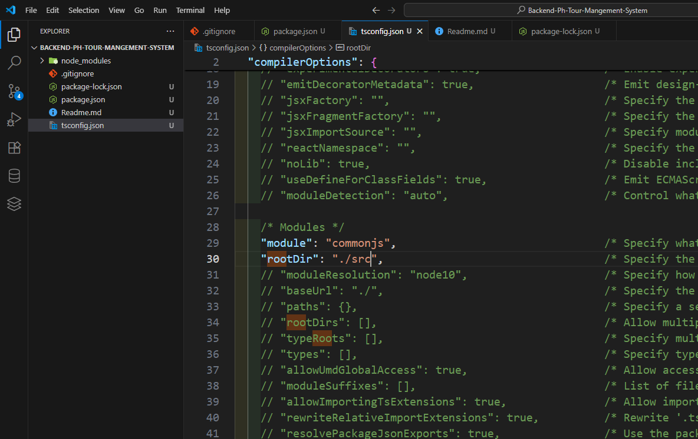
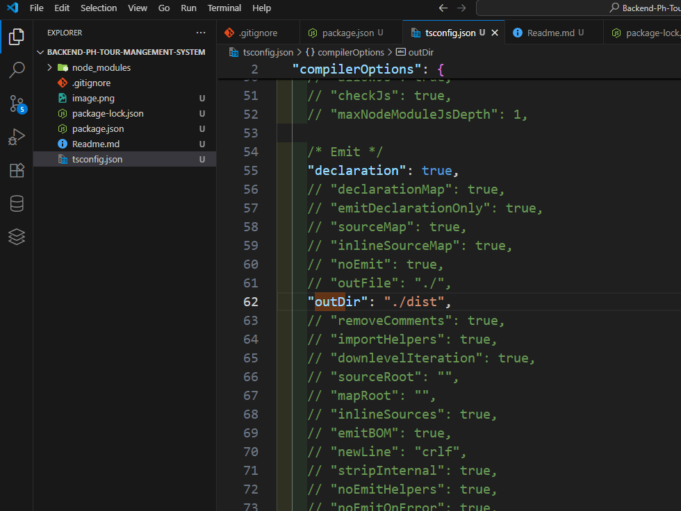
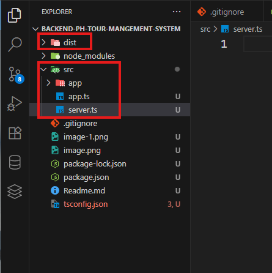
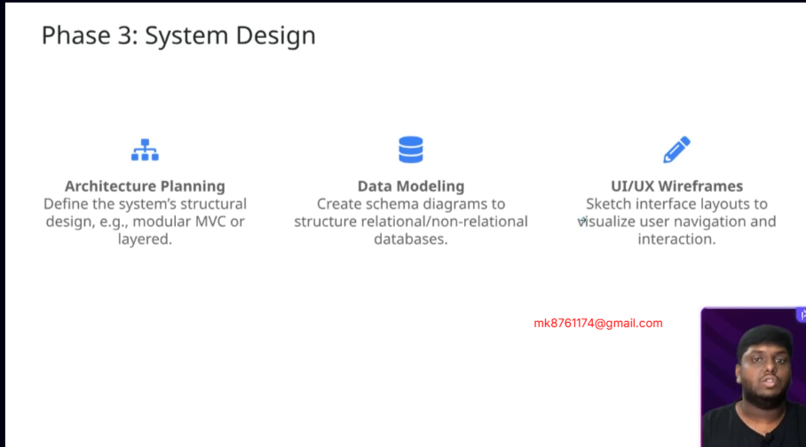

GitHub Link: https://github.com/Apollo-Level2-Web-Dev/ph-tour-management-system-backend/tree/part-6
 # PH-TOUR-MANAGEMENT-BACKEND-6

 ## 31-1 Create interface and model for Booking and Payment
- What we will learn In tHis Module ?
  1. Booking Module
  2. Payment Module (SSLCOMERZ)
  3. Transaction and Rollback 
  4. Image Uploading

#### Lets Understand The flow first 
- User -> Booking(pending) -> payment(unpaid) -> SSLCOMMERZ -> Booking Updat = Confirmed -> payment Update = Paid 

- booking.interface.ts 

```ts 
import { Types } from "mongoose";
export enum BOOKING_STATUS {
    PENDING = "PENDING",
    CANCEL = "CANCEL",
    FAILED = "FAILED",
    COMPLETE = "COMPLETE"
}
export interface IBooking {
    user: Types.ObjectId,
    tour: Types.ObjectId,
    payment?: Types.ObjectId,
    guestCount : number,
    status: BOOKING_STATUS
}
```

- payment.controller.ts 

```ts 
/* eslint-disable @typescript-eslint/no-explicit-any */
import { Types } from "mongoose";

export enum PAYMENT_STATUS {
    PAID = "PAID",
    UNPAID = "UNPAID",
    CANCELLED = "CANCELLED",
    FAILED = "FAILED",
    REFUNDED = "REFUNDED"
}
export interface IPayment {
    booking: Types.ObjectId,
    transactionId: string, //we will generate unique id 
    amount: number, //will be calculated using the guests number 
    paymentGatewayData?: any,
    // this is kept optional because initially we will create pending payment data and after successful payment it will be coming from sslcomerge so for this reason it will be any type 
    invoiceUrl?: string,
    // this will be coming from sslcommerge as well after successful payment 
    status: PAYMENT_STATUS
}
```
- here we can directly see the payment information inside the booking information we do not need to query for getting the payment information by searching using id. 

## 31-2 Create model for Booking and Payment
- done in part-3 

## 31-3 Create Booking and Payment

- payment.interface.ts 

```ts 
/* eslint-disable @typescript-eslint/no-explicit-any */
import { Types } from "mongoose";

export enum PAYMENT_STATUS {
    PAID = "PAID",
    UNPAID = "UNPAID",
    CANCELLED = "CANCELLED",
    FAILED = "FAILED",
    REFUNDED = "REFUNDED"
}
export interface IPayment {
    booking: Types.ObjectId,
    transactionId: string, //we will generate unique id 
    amount: number, //will be calculated using the guests number 
    paymentGatewayData?: any,
    // this is kept optional because initially we will create pending payment data and after successful payment it will be coming from sslcomerge so for this reason it will be any type 
    invoiceUrl?: string,
    // this will be coming from sslcommerge as well after successful payment 
    status: PAYMENT_STATUS
}
```
- payment.model.ts 

```ts 
import { model, Schema } from "mongoose";
import { IPayment, PAYMENT_STATUS } from "./payment.interface";


const paymentSchema = new Schema<IPayment>(
    {
        booking: {
            type: Schema.Types.ObjectId,
            ref: "Booking",
            required: true,
            unique: true
        },
        transactionId: {
            type: String,
            required: true,
            unique: true
        },
        status: {
            type: String,
            enum: Object.values(PAYMENT_STATUS),
            default: PAYMENT_STATUS.UNPAID
        },
        amount: {
            type: Number,
            required: true
        },

        paymentGatewayData: {
            // this will be mixed as we have use any as type in interface 
            type: Schema.Types.Mixed,

        },
        invoiceUrl: {
            type: String
        }
    },
    {
        timestamps: false
    }
)

export const Payment = model<IPayment>("Payment", paymentSchema)
```
- booking.interface.ts 

```ts 
import { Types } from "mongoose";
export enum BOOKING_STATUS {
    PENDING = "PENDING",
    CANCEL = "CANCEL",
    FAILED = "FAILED",
    COMPLETE = "COMPLETE"
}
export interface IBooking {
    user: Types.ObjectId,
    tour: Types.ObjectId,
    payment?: Types.ObjectId,
    guestCount: number,
    status: BOOKING_STATUS
}
```

- booking.model.ts 

```ts 
import { model, Schema } from "mongoose";
import { BOOKING_STATUS, IBooking } from "./booking.interface";


const bookingSchema = new Schema<IBooking>(
    {
        user: {
            type: Schema.Types.ObjectId,
            ref: "User",
            required: true
        },
        tour: {
            type: Schema.Types.ObjectId,
            ref: "Tour",
            required: true
        },
        payment: {
            type: Schema.Types.ObjectId,
            ref: "Payment",
        },
        status: {
            type: String,
            enum: Object.values(BOOKING_STATUS),
            default: BOOKING_STATUS.PENDING
        },
        guestCount: {
            type: Number,
            required: true
        }
    },
    {
        timestamps: false
    }
)

export const Booking = model<IBooking>("Booking", bookingSchema)
```
- booking.validation.ts 

```ts 
import { z } from "zod";
import { BOOKING_STATUS } from "./booking.interface";

export const createBookingZodSchema = z.object({
    tour: z.string(),
    guestCount: z.number().int().positive()

});

export const updateBookingStatusZodSchema = z.object({
    status: z.enum(Object.values(BOOKING_STATUS) as [string]),
});
```

- payment.model.ts 

```ts 
import { model, Schema } from "mongoose";
import { IPayment, PAYMENT_STATUS } from "./payment.interface";


const paymentSchema = new Schema<IPayment>(
    {
        booking: {
            type: Schema.Types.ObjectId,
            ref: "Booking",
            required: true,
            unique: true
        },
        transactionId: {
            type: String,
            required: true,
            unique: true
        },
        status: {
            type: String,
            enum: Object.values(PAYMENT_STATUS),
            default: PAYMENT_STATUS.UNPAID
        },
        amount: {
            type: Number,
            required: true
        },

        paymentGatewayData: {
            // this will be mixed as we have use any as type in interface 
            type: Schema.Types.Mixed,

        },
        invoiceUrl: {
            type : String
        }
    },
{
    timestamps: false
}
)

export const Booking = model<IPayment>("Payment", paymentSchema)
```
- booking.route.ts 

```ts 
import express from "express";

import { checkAuth } from "../../middlewares/checkAuth";
import { validateRequest } from "../../middlewares/validateRequest";
import { Role } from "../user/user.interface";
import { createBookingZodSchema, updateBookingStatusZodSchema } from "./booking.validation";
import { BookingController } from "./booking.controller";

const router = express.Router();

// api/v1/booking
router.post("/",
    checkAuth(...Object.values(Role)),
    validateRequest(createBookingZodSchema),
    BookingController.createBooking
);

// api/v1/booking
router.get("/",
    checkAuth(Role.ADMIN, Role.SUPER_ADMIN),
    BookingController.getAllBookings
);

// api/v1/booking/my-bookings
router.get("/my-bookings",
    checkAuth(...Object.values(Role)),
    BookingController.getUserBookings
);

// api/v1/booking/bookingId
router.get("/:bookingId",
    checkAuth(...Object.values(Role)),
    BookingController.getSingleBooking
);

// api/v1/booking/bookingId/status
router.patch("/:bookingId/status",
    checkAuth(...Object.values(Role)),
    validateRequest(updateBookingStatusZodSchema),
    BookingController.updateBookingStatus
);

export const BookingRoutes = router;
```

- booking.controller.ts 

```ts 
import { Request, Response } from "express";

import { catchAsync } from "../../utils/catchAsync";
import { sendResponse } from "../../utils/sendResponse";
import { BookingService } from "./booking.service";
import { JwtPayload } from "jsonwebtoken";


const createBooking = catchAsync(async (req: Request, res: Response) => {
    const decodedToken = req.user as JwtPayload
    const booking = await BookingService.createBooking(req.body, decodedToken.userId);
    sendResponse(res, {
        statusCode: 201,
        success: true,
        message: "Booking created successfully",
        data: booking,
    });
});

const getUserBookings = catchAsync(
    async (req: Request, res: Response) => {
        const bookings = await BookingService.getUserBookings();
        sendResponse(res, {
            statusCode: 200,
            success: true,
            message: "Bookings retrieved successfully",
            data: bookings,
        });
    }
);
const getSingleBooking = catchAsync(
    async (req: Request, res: Response) => {
        const booking = await BookingService.getBookingById();
        sendResponse(res, {
            statusCode: 200,
            success: true,
            message: "Booking retrieved successfully",
            data: booking,
        });
    }
);

const getAllBookings = catchAsync(
    async (req: Request, res: Response) => {
        // eslint-disable-next-line @typescript-eslint/no-unused-vars
        const bookings = await BookingService.getAllBookings();
        sendResponse(res, {
            statusCode: 200,
            success: true,
            message: "Bookings retrieved successfully",
            data: {},
            // meta: {},
        });
    }
);

const updateBookingStatus = catchAsync(
    async (req: Request, res: Response) => {

        const updated = await BookingService.updateBookingStatus(
        );
        sendResponse(res, {
            statusCode: 200,
            success: true,
            message: "Booking Status Updated Successfully",
            data: updated,
        });
    }
);


export const BookingController = {
    createBooking,
    getAllBookings,
    getSingleBooking,
    getUserBookings,
    updateBookingStatus,
}
```

- booking.service.ts 

```ts 
import AppError from "../../errorHelpers/AppError";
import { User } from "../user/user.model";
import { BOOKING_STATUS, IBooking } from "./booking.interface";
import httpStatus from 'http-status-codes';
import { Booking } from "./booking.model";
import { Payment } from "../payment/payment.model";
import { PAYMENT_STATUS } from "../payment/payment.interface";
import { Tour } from "../tour/tour.model";


const getTransactionId = () => {
    return `tran_${Date.now()}_${Math.floor(Math.random() * 1000)}`
}

const createBooking = async (payload: Partial<IBooking>, userId: string) => {

    const transactionId = getTransactionId()

    const user = await User.findById(userId)
    if (!user?.phone || !user?.address) {
        throw new AppError(httpStatus.BAD_REQUEST, "Please Add Phone Number and Address In Your Profile For Booking!")
    }

    const tour = await Tour.findById(payload.tour).select("costFrom")

    if (!tour?.costFrom) {
        throw new AppError(httpStatus.BAD_REQUEST, "Tour Cost is Not Added!, Wait Until Cost Is Added!")
    }

    // eslint-disable-next-line @typescript-eslint/no-non-null-assertion
    const amount = Number(tour.costFrom) * Number(payload.guestCount!)


    const booking = await Booking.create({
        user: userId,
        status: BOOKING_STATUS.PENDING,
        ...payload
    })

    const payment = await Payment.create({
        booking: booking._id,
        status: PAYMENT_STATUS.UNPAID,
        transactionId: transactionId,
        amount

    })

    const updatedBooking = await Booking.findByIdAndUpdate(
        booking._id,
        { payment: payment._id },
        { runValidators: true, new: true }
    )
        .populate("user", "name email address")
        .populate("tour", "title costFrom")
        .populate("payment")

    return updatedBooking
};

const getUserBookings = async () => {

    return {}
};

const getBookingById = async () => {
    return {}
};

const updateBookingStatus = async (

) => {

    return {}
};

const getAllBookings = async () => {

    return {}
};

export const BookingService = {
    createBooking,
    getUserBookings,
    getBookingById,
    updateBookingStatus,
    getAllBookings,
};
```
## 31-4 Use Transaction and Rollback for Booking and Payment
- while creating a booking payment is also getting created and as well the booking is getting updated afterwords. if any error happend in any process this will create a issue. for solving the issue , i mean if any error happens rollback the whole process we have to use `transaction rollback`

#### How Transaction Rollback working ?


- Creates a replica of a DB Collection 
- Creates an environment/ session for all the write operations 
- If success and no error ! Replica DB -> [ Create Booking -> Create Payment ->  Update Booking] -> Real DB 
- If Any Error Happens In any stage Replica DB -> [ Create Booking -> Create Payment ->  Update Booking -> Error] -> Rollback The process

#### Lets do code for it 

- remember transaction rollback is done when parallel write operation is done in different collection at a time 

1. create and start the session 
  - create a session over Booking model since all are happening over booking module 
  
  ```ts
    // 1. start session
    const session = await Booking.startSession()

    //2.  start transaction 
    session.startTransaction()
  ```

2. apply try catch and
   - inside the try do all the operation and business logic 
   -  inside the catch handle the error of the session and aborting the session 
    
      ```ts
      const createBooking = async (payload: Partial<IBooking>, userId: string) => {
        const transactionId = getTransactionId()
        // create a session over Booking model since all are happening over booking module 
        // // 1. start session
        const session = await Booking.startSession()
        //2.  start transaction 
        
        session.startTransaction()

        // inside the try do all the operation and business logic 
        try {
        // 

        const user = await User.findById(userId)
        if (!user?.phone || !user?.address) {
            throw new AppError(httpStatus.BAD_REQUEST, "Please Add Phone Number and Address In Your Profile For Booking!")
        }

        const tour = await Tour.findById(payload.tour).select("costFrom")

        if (!tour?.costFrom) {
            throw new AppError(httpStatus.BAD_REQUEST, "Tour Cost is Not Added!, Wait Until Cost Is Added!")
        }

        // eslint-disable-next-line @typescript-eslint/no-non-null-assertion
        const amount = Number(tour.costFrom) * Number(payload.guestCount!)


        const booking = await Booking.create({
            user: userId,
            status: BOOKING_STATUS.PENDING,
            ...payload
        })

        const payment = await Payment.create({
            booking: booking._id,
            status: PAYMENT_STATUS.UNPAID,
            transactionId: transactionId,
            amount

        })

        const updatedBooking = await Booking.findByIdAndUpdate(
            booking._id,
            { payment: payment._id },
            { runValidators: true, new: true }
        )
            .populate("user", "name email address")
            .populate("tour", "title costFrom")
            .populate("payment")


        // After success commit the transaction and end the transaction 
        // here committing means inserting all the operation data to actual db from virtual database copy. 
        await session.commitTransaction(); //transaction
        session.endSession()

        return updatedBooking
        } catch (error) {
        // inside the catch handle the error of the session and aborting the session 
        await session.abortTransaction()
        // throw new AppError(httpStatus.BAD_REQUEST, error) ❌❌
        throw error
        //  here we do not need to use our custom AppError because mongoose already has the error pattern for this and our AppError Do Not know about the error. Mongoose does the works for us. 
        }
        };
      ```
    - Inside catch we do not need to use our custom AppError because mongoose already has the error pattern for this and our AppError Do Not know about the error. Mongoose does the works for us.
    - We have to close the transaction and session after successful operation inside try as well like catch 
    -  After success commit the transaction and end the transaction 
    - here committing means inserting all the operation data to actual db from virtual database copy. 

#### Our Pattern is ready now. 
- lets touch the operations now because session has its own pattern of operation 

- remember we have to give sessions for the write operations and all the read operations automatically be done under the session. 
```ts 
        const booking = await Booking.create([{
            user: userId,
            status: BOOKING_STATUS.PENDING,
            ...payload
        }], { session })
```
- feels different? yeah Its the pattern of session. we have to keep the first parameters inside an array and second parameter i means session will be inside an object 
- and overall it will return an array which will contain the array(operation commands) and object(session) inside an array. 
- The first argument must be an array (even if you're creating a single document).
- The second argument is an options object, where you pass the session: { session }.
- The return value of .create() (in this array format) will be an array of created documents, so to access the document, use booking[0].
- If we want to use anything from it we have to destructure it from the array. like  `booking[0]._id,` as the first index holds the data and second index holds the session

```ts 
        const payment = await Payment.create(
            [
                {
                    booking: booking[0]._id,
                    status: PAYMENT_STATUS.UNPAID,
                    transactionId: transactionId,
                    amount
                }
            ],
            { session }
        )

```

- remember we do not have to keep fist parameter in array for `findByIdAndUpdate`. because It doesn't perform a bulk insert — it updates a single document and returns it. Even for one document, when using sessions, `.create()` internally switches to a bulk insert behavior to ensure transactional safety.

```ts 
        const updatedBooking = await Booking
            .findByIdAndUpdate(
                booking[0]._id,
                { payment: payment[0]._id },
                { new: true, runValidators: true, session }
            )
            .populate("user", "name email phone address")
            .populate("tour", "title costFrom")
            .populate("payment");
```

| Operation              | Needs array? | Session support? | Notes                                          |
| ---------------------- | ------------ | ---------------- | ---------------------------------------------- |
| `.create()`            | ✅ Yes        | ✅ Yes            | Must be array when used with session           |
| `.insertMany()`        | ✅ Yes        | ✅ Yes            | Same as above                                  |
| `.findOneAndUpdate()`  | ❌ No         | ✅ Yes            | Accepts a filter object and works with session |
| `.findByIdAndUpdate()` | ❌ No         | ✅ Yes            | Accepts ID directly                            |
| `.updateOne()`         | ❌ No         | ✅ Yes            | Accepts filter + update object                 |
| `.deleteOne()`         | ❌ No         | ✅ Yes            | Standard query-based delete                    |
| `.deleteMany()`        | ❌ No         | ✅ Yes            | For bulk deletes                               |

- final code booking.service.ts 

```ts 
    const createBooking = async (payload: Partial<IBooking>, userId: string) => {

    const transactionId = getTransactionId()

    // create a session over Booking model since all are happening over booking module 

    // 1. start session
    const session = await Booking.startSession()

    //2.  start transaction 
    session.startTransaction()

    // inside the try do all the operation and business logic 
    try {
        // 

        const user = await User.findById(userId)
        if (!user?.phone || !user?.address) {
            throw new AppError(httpStatus.BAD_REQUEST, "Please Add Phone Number and Address In Your Profile For Booking!")
        }

        const tour = await Tour.findById(payload.tour).select("costFrom")

        if (!tour?.costFrom) {
            throw new AppError(httpStatus.BAD_REQUEST, "Tour Cost is Not Added!, Wait Until Cost Is Added!")
        }

        // eslint-disable-next-line @typescript-eslint/no-non-null-assertion
        const amount = Number(tour.costFrom) * Number(payload.guestCount!)


        const booking = await Booking.create([{
            user: userId,
            status: BOOKING_STATUS.PENDING,
            ...payload
        }], { session })


        const payment = await Payment.create(
            [
                {
                    booking: booking[0]._id,
                    status: PAYMENT_STATUS.UNPAID,
                    transactionId: transactionId,
                    amount
                }
            ],
            { session }
        )

        const updatedBooking = await Booking
            .findByIdAndUpdate(
                booking[0]._id,
                { payment: payment[0]._id },
                { new: true, runValidators: true, session }
            )
            .populate("user", "name email phone address")
            .populate("tour", "title costFrom")
            .populate("payment");


        // After success commit the transaction and end the transaction 
        // here committing means inserting all the operation data to actual db from virtual database copy. 
        await session.commitTransaction(); //transaction
        session.endSession()

        return updatedBooking
    } catch (error) {
        // inside the catch handle the error of the session and aborting the session 
        await session.abortTransaction()
        // throw new AppError(httpStatus.BAD_REQUEST, error) ❌❌
        throw error
        //  here we do not need to use our custom AppError because mongoose already has the error pattern for this and our AppError Do Not know about the error. Mongoose does the works for us. 
    }

};
```
## 31-5 Intro to SSL Commerz , Account Creation Process

[SSLCOMERZ](https://developer.sslcommerz.com/)

#### Create Account 
- create a sandbox account 



- in final stage 



#### How sslcommerg payment will be done? 
-  Frontend(localhost:5173) - User - Tour - Booking (Pending) - Payment(Unpaid) -> SSLCommerz Page -> Payment Complete -> Backend(localhost:5000/api/v1/payment/success) -> Update Payment(PAID) & Booking(CONFIRM) -> redirect to frontend -> Frontend(localhost:5173/payment/success)

- Frontend(localhost:5173) - User - Tour - Booking (Pending) - Payment(Unpaid) -> SSLCommerz Page -> Payment Fail / Cancel -> Backend(localhost:5000) -> Update Payment(FAIL / CANCEL) & Booking(FAIL / CANCEL) -> redirect to frontend -> Frontend(localhost:5173/payment/cancel or localhost:5173/payment/fail)

## SSLCOMMERZ Integration Instructions

### 📝 Registration Links

- For registration in **Sandbox**, click the link:  
  [https://developer.sslcommerz.com/registration/](https://developer.sslcommerz.com/registration/)

- For registration in **Production**, click the link:  
  [https://signup.sslcommerz.com/register](https://signup.sslcommerz.com/register)

---

### 🧩 Integration Methods

There are two processes of integration:

1. **SSLCOMMERZ Easy Checkout** in your checkout page  
2. **Redirect the customer** from your checkout page to **SSLCOMMERZ Hosted page**

---

#### 🔌 Required APIs

You will use **three APIs** of SSLCOMMERZ to complete the integration:

1. **Create and Get Session**  
2. **Receive Payment Notification (IPN)**  
3. **Order Validation API**

---

#### ✅ Mandatory Steps

- You must **validate your transaction and amount** by calling the **Order Validation API**  
- You must **develop the IPN URL** to receive the **payment notification**

---

#### ⚠️ Risk Payments

Sometimes you will get **Risk payments**  
(In response you will get `risk` properties — value will be:

- `0` for **safe**
- `1` for **risky**

> It depends on you to provide the service or not.




| Step                           | Required | Notes                        |
| ------------------------------ | -------- | ---------------------------- |
| Register sandbox/production    | ✅        | Get credentials              |
| Create payment session         | ✅        | Call API to get session URL  |
| Setup success/fail/cancel URLs | ✅        | Handle in frontend/backend   |
| Setup IPN endpoint             | ✅        | For server-side notification |
| Call validation API            | ✅        | To confirm amount, status    |
| Handle risk levels             | ✅        | Based on business decision   |




#### 🔁 Transaction Initiate

The Steps 1, 2 and 3 are used to make the request for a new transaction. After getting confirmation of checkout from customer, merchant server sends a request to SSLCOMMERZ server to get a Session ID. If all the credentials and mandatory fields are valid, then SSLCOMMERZ provides a Session ID to Merchant System. After receiving the Session ID, Merchant System redirects the customer to payment page with Session ID.

---

#### 📬 Handling Payment Notification

The Step 4 and 5 are processed at this stage. For any notification, SSLCOMMERZ will send HTTP message in POST method called IPN Message to the Listener which is to be configured by the Merchant at their SSLCOMMERZ Administrator Panel. After receiving the message, you must validate the message with Transaction Validation API of SSLCOMMERZ.

---

#### ✅ Service Confirmation

At Step 5, SSLCOMMERZ will redirect the customer to merchant’s side. At this stage, Merchant will display the notification of Service Confirmation.
## 31-6 Setting Up interface for SSL Commerz with env


#### lets initialize payment 

- sslCommerz.interface.ts 

```ts 
export interface ISSLCommerz {
    amount: number;
    transactionId: string;
    name: string,
    email: string,
    phoneNumber: string;
    address: string
}
```

- for fetch we will use axios instead of raw fetch. for sslcommerz server communication 

```
npm i axios
```

- sslCommerz.service.ts 

```ts 
import axios from "axios"
import httpStatus from "http-status-codes"
import { envVars } from "../../config/env"
import AppError from "../../errorHelpers/AppError"
import { ISSLCommerz } from "./sslCommerz.interface"

const sslPaymentInit = async (payload: ISSLCommerz) => {

    try {
        const data = {
            store_id: envVars.SSL.STORE_ID,
            store_passwd: envVars.SSL.STORE_PASS,
            total_amount: payload.amount,
            currency: "BDT",
            tran_id: payload.transactionId,
            success_url: `${envVars.SSL.SSL_SUCCESS_BACKEND_URL}?transactionId=${payload.transactionId}&amount=${payload.amount}&status=success`,
            fail_url: `${envVars.SSL.SSL_FAIL_BACKEND_URL}?transactionId=${payload.transactionId}&amount=${payload.amount}&status=fail`,
            cancel_url: `${envVars.SSL.SSL_CANCEL_BACKEND_URL}?transactionId=${payload.transactionId}&amount=${payload.amount}&status=cancel`,
            // ipn_url: "http://localhost:3030/ipn",
            shipping_method: "N/A",
            product_name: "Tour",
            product_category: "Service",
            product_profile: "general",
            cus_name: payload.name,
            cus_email: payload.email,
            cus_add1: payload.address,
            cus_add2: "N/A",
            cus_city: "Dhaka",
            cus_state: "Dhaka",
            cus_postcode: "1000",
            cus_country: "Bangladesh",
            cus_phone: payload.phoneNumber,
            cus_fax: "01711111111",
            ship_name: "N/A",
            ship_add1: "N/A",
            ship_add2: "N/A",
            ship_city: "N/A",
            ship_state: "N/A",
            ship_postcode: 1000,
            ship_country: "N/A",
        }

        const response = await axios({
            method: "POST",
            url: envVars.SSL.SSL_PAYMENT_API,
            data: data,
            headers: { "Content-Type": "application/x-www-form-urlencoded" }
        })

        return response.data;
        // eslint-disable-next-line @typescript-eslint/no-explicit-any
    } catch (error: any) {
        console.log("Payment Error Occured", error);
        throw new AppError(httpStatus.BAD_REQUEST, error.message)
    }
}

export const SSLService = {
    sslPaymentInit
}

```
## 31-7 Complete Initializing Payment with SSLCommerz
- booking.service.ts 

```ts 
/* eslint-disable no-console */
/* eslint-disable @typescript-eslint/no-explicit-any */
import AppError from "../../errorHelpers/AppError";
import { User } from "../user/user.model";
import { BOOKING_STATUS, IBooking } from "./booking.interface";
import httpStatus from 'http-status-codes';
import { Booking } from "./booking.model";
import { Payment } from "../payment/payment.model";
import { PAYMENT_STATUS } from "../payment/payment.interface";
import { Tour } from "../tour/tour.model";
import { ISSLCommerz } from "../sslCommerz/sslCommerz.interface";
import { SSLService } from "../sslCommerz/sslCommerz.service";


const getTransactionId = () => {
    return `tran_${Date.now()}_${Math.floor(Math.random() * 1000)}`
}

const createBooking = async (payload: Partial<IBooking>, userId: string) => {

    const transactionId = getTransactionId()

    // create a session over Booking model since all are happening over booking module 

    // 1. start session
    const session = await Booking.startSession()

    //2.  start transaction 
    session.startTransaction()

    // inside the try do all the operation and business logic 
    try {
        // 

        const user = await User.findById(userId)
        if (!user?.phone || !user?.address) {
            throw new AppError(httpStatus.BAD_REQUEST, "Please Add Phone Number and Address In Your Profile For Booking!")
        }

        const tour = await Tour.findById(payload.tour).select("costFrom")

        if (!tour?.costFrom) {
            throw new AppError(httpStatus.BAD_REQUEST, "Tour Cost is Not Added!, Wait Until Cost Is Added!")
        }

        // eslint-disable-next-line @typescript-eslint/no-non-null-assertion
        const amount = Number(tour.costFrom) * Number(payload.guestCount!)


        const booking = await Booking.create([{
            user: userId,
            status: BOOKING_STATUS.PENDING,
            ...payload
        }], { session })


        const payment = await Payment.create(
            [
                {
                    booking: booking[0]._id,
                    status: PAYMENT_STATUS.UNPAID,
                    transactionId: transactionId,
                    amount
                }
            ],
            { session }
        )

        const updatedBooking = await Booking
            .findByIdAndUpdate(
                booking[0]._id,
                { payment: payment[0]._id },
                { new: true, runValidators: true, session }
            )
            .populate("user", "name email phone address")
            .populate("tour", "title costFrom")
            .populate("payment");


        // for sslCommerz

        //we are forcefully saying that you are not a objectId 
        // we are doing like this because these fields are coming from the populated field 
        const userAddress = (updatedBooking?.user as any).address
        const userEmail = (updatedBooking?.user as any).email
        const userPhoneNumber = (updatedBooking?.user as any).phone
        const userName = (updatedBooking?.user as any).name

        const sslPayload: ISSLCommerz = {
            address: userAddress,
            email: userEmail,
            phoneNumber: userPhoneNumber,
            name: userName,
            amount: amount,
            transactionId: transactionId
        }
        // initiate the sslCommerg

        const sslPayment = await SSLService.sslPaymentInit(sslPayload)


        // After success commit the transaction and end the transaction 
        // here committing means inserting all the operation data to actual db from virtual database copy. 
        await session.commitTransaction(); //transaction
        session.endSession()

        return {
            paymentUrl: sslPayment.GatewayPageURL,
            booking: updatedBooking
        }

    } catch (error) {
        // inside the catch handle the error of the session and aborting the session 
        await session.abortTransaction()
        // throw new AppError(httpStatus.BAD_REQUEST, error) ❌❌
        throw error
        //  here we do not need to use our custom AppError because mongoose already has the error pattern for this and our AppError Do Not know about the error. Mongoose does the works for us. 
    }

};


export const BookingService = {
    createBooking,
};
```

- from here it will init the sslComerz 
- sslComerz.service.ts 

```ts 
import axios from "axios"
import httpStatus from "http-status-codes"
import { envVars } from "../../config/env"
import AppError from "../../errorHelpers/AppError"
import { ISSLCommerz } from "./sslCommerz.interface"

const sslPaymentInit = async (payload: ISSLCommerz) => {

    try {
        const data = {
            store_id: envVars.SSL.STORE_ID,
            store_passwd: envVars.SSL.STORE_PASS,
            total_amount: payload.amount,
            currency: "BDT",
            tran_id: payload.transactionId,
            success_url: `${envVars.SSL.SSL_SUCCESS_BACKEND_URL}?transactionId=${payload.transactionId}&amount=${payload.amount}&status=success`, //takes to default post 
            fail_url: `${envVars.SSL.SSL_FAIL_BACKEND_URL}?transactionId=${payload.transactionId}&amount=${payload.amount}&status=fail`, //takes to default post 
            cancel_url: `${envVars.SSL.SSL_CANCEL_BACKEND_URL}?transactionId=${payload.transactionId}&amount=${payload.amount}&status=cancel`, //takes to default post 
            // ipn_url: "http://localhost:3030/ipn",
            shipping_method: "N/A",
            product_name: "Tour",
            product_category: "Service",
            product_profile: "general",
            cus_name: payload.name,
            cus_email: payload.email,
            cus_add1: payload.address,
            cus_add2: "N/A",
            cus_city: "Dhaka",
            cus_state: "Dhaka",
            cus_postcode: "1000",
            cus_country: "Bangladesh",
            cus_phone: payload.phoneNumber,
            cus_fax: "01711111111",
            ship_name: "N/A",
            ship_add1: "N/A",
            ship_add2: "N/A",
            ship_city: "N/A",
            ship_state: "N/A",
            ship_postcode: 1000,
            ship_country: "N/A",
        }

        const response = await axios({
            method: "POST",
            url: envVars.SSL.SSL_PAYMENT_API,
            data: data,
            headers: { "Content-Type": "application/x-www-form-urlencoded" }
        })

        return response.data;
        // eslint-disable-next-line @typescript-eslint/no-explicit-any
    } catch (error: any) {
        console.log("Payment Error Occured", error);
        throw new AppError(httpStatus.BAD_REQUEST, error.message)
    }
}

export const SSLService = {
    sslPaymentInit
}
```

- then it will redirect to ssl payment page 
- After successful payment it will hit a backend api and update the booking and payment collection 

- payment.route.ts 

```ts 
import express from "express";
import { PaymentController } from "./payment.controller";


const router = express.Router();


router.post("/success", PaymentController.successPayment);
export const PaymentRoutes = router;
```

- payment.controller.ts 

```ts 
import { Request, Response } from "express";
import { envVars } from "../../config/env";
import { catchAsync } from "../../utils/catchAsync";
import { sendResponse } from "../../utils/sendResponse";
import { PaymentService } from "./payment.service";


const successPayment = catchAsync(async (req: Request, res: Response) => {
    const query = req.query
    const result = await PaymentService.successPayment(query as Record<string, string>)

    if (result.success) {
        res.redirect(`${envVars.SSL.SSL_SUCCESS_FRONTEND_URL}?transactionId=${query.transactionId}&message=${result.message}&amount=${query.amount}&status=${query.status}`)
    }
});


export const PaymentController = {
    successPayment,
};
```
- we will not use sendResponse in the controller because there is nothing to send response
- payment.service.ts 

```ts 

/* eslint-disable @typescript-eslint/no-explicit-any */
import httpStatus from "http-status-codes";
import AppError from "../../errorHelpers/AppError";
import { BOOKING_STATUS } from "../booking/booking.interface";
import { Booking } from "../booking/booking.model";
import { ISSLCommerz } from "../sslCommerz/sslCommerz.interface";
import { SSLService } from "../sslCommerz/sslCommerz.service";
import { PAYMENT_STATUS } from "./payment.interface";
import { Payment } from "./payment.model";

const successPayment = async (query: Record<string, string>) => {

    // Update Booking Status to COnfirm 
    // Update Payment Status to PAID

    const session = await Booking.startSession();
    session.startTransaction()

    try {
        const updatedPayment = await Payment.findOneAndUpdate({ transactionId: query.transactionId }, {
            status: PAYMENT_STATUS.PAID,
        }, { new: true, runValidators: true, session: session })

        await Booking
            .findByIdAndUpdate(
                updatedPayment?.booking,
                { status: BOOKING_STATUS.COMPLETE },
                { runValidators: true, session }
            )

        await session.commitTransaction(); //transaction
        session.endSession()
        return { success: true, message: "Payment Completed Successfully" }
    } catch (error) {
        await session.abortTransaction(); // rollback
        session.endSession()
        throw error
    }
};


export const PaymentService = {
    successPayment,
};
```
## 31-8 Complete Fail and Cancel Payment , Create additional API to initialize Payment for a Booking

- payment.route.ts 

```ts 

import express from "express";
import { PaymentController } from "./payment.controller";


const router = express.Router();

router.post("/success", PaymentController.successPayment);
router.post("/fail", PaymentController.failPayment);
router.post("/cancel", PaymentController.cancelPayment);
export const PaymentRoutes = router;
```

- payment.controller.ts

```ts 
import { Request, Response } from "express";
import { envVars } from "../../config/env";
import { catchAsync } from "../../utils/catchAsync";
import { sendResponse } from "../../utils/sendResponse";
import { PaymentService } from "./payment.service";

const successPayment = catchAsync(async (req: Request, res: Response) => {
    const query = req.query
    const result = await PaymentService.successPayment(query as Record<string, string>)

    if (result.success) {
        res.redirect(`${envVars.SSL.SSL_SUCCESS_FRONTEND_URL}?transactionId=${query.transactionId}&message=${result.message}&amount=${query.amount}&status=${query.status}`)
    }
});
const failPayment = catchAsync(async (req: Request, res: Response) => {
    const query = req.query
    const result = await PaymentService.failPayment(query as Record<string, string>)

    if (!result.success) {
        res.redirect(`${envVars.SSL.SSL_FAIL_FRONTEND_URL}?transactionId=${query.transactionId}&message=${result.message}&amount=${query.amount}&status=${query.status}`)
    }
});
const cancelPayment = catchAsync(async (req: Request, res: Response) => {
    const query = req.query
    const result = await PaymentService.cancelPayment(query as Record<string, string>)

    if (!result.success) {
        res.redirect(`${envVars.SSL.SSL_CANCEL_FRONTEND_URL}?transactionId=${query.transactionId}&message=${result.message}&amount=${query.amount}&status=${query.status}`)
    }
});

export const PaymentController = {
    successPayment,
    failPayment,
    cancelPayment,
};
```

- payment.service.ts 

```ts 
/* eslint-disable @typescript-eslint/no-explicit-any */
import httpStatus from "http-status-codes";
import AppError from "../../errorHelpers/AppError";
import { BOOKING_STATUS } from "../booking/booking.interface";
import { Booking } from "../booking/booking.model";
import { ISSLCommerz } from "../sslCommerz/sslCommerz.interface";
import { SSLService } from "../sslCommerz/sslCommerz.service";
import { PAYMENT_STATUS } from "./payment.interface";
import { Payment } from "./payment.model";
const successPayment = async (query: Record<string, string>) => {

    // Update Booking Status to COnfirm 
    // Update Payment Status to PAID

    const session = await Booking.startSession();
    session.startTransaction()

    try {


        const updatedPayment = await Payment.findOneAndUpdate({ transactionId: query.transactionId }, {
            status: PAYMENT_STATUS.PAID,
        }, { new: true, runValidators: true, session: session })

        await Booking
            .findByIdAndUpdate(
                updatedPayment?.booking,
                { status: BOOKING_STATUS.COMPLETE },
                { runValidators: true, session }
            )

        await session.commitTransaction(); //transaction
        session.endSession()
        return { success: true, message: "Payment Completed Successfully" }
    } catch (error) {
        await session.abortTransaction(); // rollback
        session.endSession()
        // throw new AppError(httpStatus.BAD_REQUEST, error) ❌❌
        throw error
    }
};
const failPayment = async (query: Record<string, string>) => {

    // Update Booking Status to FAIL
    // Update Payment Status to FAIL

    const session = await Booking.startSession();
    session.startTransaction()

    try {


        const updatedPayment = await Payment.findOneAndUpdate({ transactionId: query.transactionId }, {
            status: PAYMENT_STATUS.FAILED,
        }, { new: true, runValidators: true, session: session })

        await Booking
            .findByIdAndUpdate(
                updatedPayment?.booking,
                { status: BOOKING_STATUS.FAILED },
                { runValidators: true, session }
            )

        await session.commitTransaction(); //transaction
        session.endSession()
        return { success: false, message: "Payment Failed" }
    } catch (error) {
        await session.abortTransaction(); // rollback
        session.endSession()
        // throw new AppError(httpStatus.BAD_REQUEST, error) ❌❌
        throw error
    }
};
const cancelPayment = async (query: Record<string, string>) => {

    // Update Booking Status to CANCEL
    // Update Payment Status to CANCEL

    const session = await Booking.startSession();
    session.startTransaction()

    try {


        const updatedPayment = await Payment.findOneAndUpdate({ transactionId: query.transactionId }, {
            status: PAYMENT_STATUS.CANCELLED,
        }, { runValidators: true, session: session })

        await Booking
            .findByIdAndUpdate(
                updatedPayment?.booking,
                { status: BOOKING_STATUS.CANCEL },
                { runValidators: true, session }
            )

        await session.commitTransaction(); //transaction
        session.endSession()
        return { success: false, message: "Payment Cancelled" }
    } catch (error) {
        await session.abortTransaction(); // rollback
        session.endSession()
        // throw new AppError(httpStatus.BAD_REQUEST, error) ❌❌
        throw error
    }
};


export const PaymentService = {
    initPayment,
    successPayment,
    failPayment,
    cancelPayment,
};

```

- all cancel and failure payment method data updating mechanism added

#### Now there is work left. Its like if anyone cancels the payment intentionally or insufficient payment we have to keep option for doing payment for the booking again.


- payment.route.ts 

```ts 
import express from "express";
import { PaymentController } from "./payment.controller";


const router = express.Router();


router.post("/init-payment/:bookingId", PaymentController.initPayment);
router.post("/success", PaymentController.successPayment);
router.post("/fail", PaymentController.failPayment);
router.post("/cancel", PaymentController.cancelPayment);
export const PaymentRoutes = router;
```

- payment.controller.ts

```ts 
import { Request, Response } from "express";
import { envVars } from "../../config/env";
import { catchAsync } from "../../utils/catchAsync";
import { sendResponse } from "../../utils/sendResponse";
import { PaymentService } from "./payment.service";


const initPayment = catchAsync(async (req: Request, res: Response) => {
    const bookingId = req.params.bookingId;
    const result = await PaymentService.initPayment(bookingId as string)
    sendResponse(res, {
        statusCode: 201,
        success: true,
        message: "Payment done successfully",
        data: result,
    });
});
const successPayment = catchAsync(async (req: Request, res: Response) => {
    const query = req.query
    const result = await PaymentService.successPayment(query as Record<string, string>)

    if (result.success) {
        res.redirect(`${envVars.SSL.SSL_SUCCESS_FRONTEND_URL}?transactionId=${query.transactionId}&message=${result.message}&amount=${query.amount}&status=${query.status}`)
    }
});
const failPayment = catchAsync(async (req: Request, res: Response) => {
    const query = req.query
    const result = await PaymentService.failPayment(query as Record<string, string>)

    if (!result.success) {
        res.redirect(`${envVars.SSL.SSL_FAIL_FRONTEND_URL}?transactionId=${query.transactionId}&message=${result.message}&amount=${query.amount}&status=${query.status}`)
    }
});
const cancelPayment = catchAsync(async (req: Request, res: Response) => {
    const query = req.query
    const result = await PaymentService.cancelPayment(query as Record<string, string>)

    if (!result.success) {
        res.redirect(`${envVars.SSL.SSL_CANCEL_FRONTEND_URL}?transactionId=${query.transactionId}&message=${result.message}&amount=${query.amount}&status=${query.status}`)
    }
});

export const PaymentController = {
    initPayment,
    successPayment,
    failPayment,
    cancelPayment,
};
```

- payment.service.ts 

```ts 

/* eslint-disable @typescript-eslint/no-explicit-any */
import httpStatus from "http-status-codes";
import AppError from "../../errorHelpers/AppError";
import { BOOKING_STATUS } from "../booking/booking.interface";
import { Booking } from "../booking/booking.model";
import { ISSLCommerz } from "../sslCommerz/sslCommerz.interface";
import { SSLService } from "../sslCommerz/sslCommerz.service";
import { PAYMENT_STATUS } from "./payment.interface";
import { Payment } from "./payment.model";

const initPayment = async (bookingId: string) => {

    const payment = await Payment.findOne({ booking: bookingId })

    if (!payment) {
        throw new AppError(httpStatus.NOT_FOUND, "Payment Not Found. You have not booked this tour")
    }

    const booking = await Booking.findById(payment.booking)

    const userAddress = (booking?.user as any).address
    const userEmail = (booking?.user as any).email
    const userPhoneNumber = (booking?.user as any).phone
    const userName = (booking?.user as any).name

    const sslPayload: ISSLCommerz = {
        address: userAddress,
        email: userEmail,
        phoneNumber: userPhoneNumber,
        name: userName,
        amount: payment.amount,
        transactionId: payment.transactionId
    }

    const sslPayment = await SSLService.sslPaymentInit(sslPayload)

    return {
        paymentUrl: sslPayment.GatewayPageURL
    }

};
const successPayment = async (query: Record<string, string>) => {

    // Update Booking Status to COnfirm 
    // Update Payment Status to PAID

    const session = await Booking.startSession();
    session.startTransaction()

    try {


        const updatedPayment = await Payment.findOneAndUpdate({ transactionId: query.transactionId }, {
            status: PAYMENT_STATUS.PAID,
        }, { new: true, runValidators: true, session: session })

        await Booking
            .findByIdAndUpdate(
                updatedPayment?.booking,
                { status: BOOKING_STATUS.COMPLETE },
                { runValidators: true, session }
            )

        await session.commitTransaction(); //transaction
        session.endSession()
        return { success: true, message: "Payment Completed Successfully" }
    } catch (error) {
        await session.abortTransaction(); // rollback
        session.endSession()
        // throw new AppError(httpStatus.BAD_REQUEST, error) ❌❌
        throw error
    }
};
const failPayment = async (query: Record<string, string>) => {

    // Update Booking Status to FAIL
    // Update Payment Status to FAIL

    const session = await Booking.startSession();
    session.startTransaction()

    try {


        const updatedPayment = await Payment.findOneAndUpdate({ transactionId: query.transactionId }, {
            status: PAYMENT_STATUS.FAILED,
        }, { new: true, runValidators: true, session: session })

        await Booking
            .findByIdAndUpdate(
                updatedPayment?.booking,
                { status: BOOKING_STATUS.FAILED },
                { runValidators: true, session }
            )

        await session.commitTransaction(); //transaction
        session.endSession()
        return { success: false, message: "Payment Failed" }
    } catch (error) {
        await session.abortTransaction(); // rollback
        session.endSession()
        // throw new AppError(httpStatus.BAD_REQUEST, error) ❌❌
        throw error
    }
};
const cancelPayment = async (query: Record<string, string>) => {

    // Update Booking Status to CANCEL
    // Update Payment Status to CANCEL

    const session = await Booking.startSession();
    session.startTransaction()

    try {


        const updatedPayment = await Payment.findOneAndUpdate({ transactionId: query.transactionId }, {
            status: PAYMENT_STATUS.CANCELLED,
        }, { runValidators: true, session: session })

        await Booking
            .findByIdAndUpdate(
                updatedPayment?.booking,
                { status: BOOKING_STATUS.CANCEL },
                { runValidators: true, session }
            )

        await session.commitTransaction(); //transaction
        session.endSession()
        return { success: false, message: "Payment Cancelled" }
    } catch (error) {
        await session.abortTransaction(); // rollback
        session.endSession()
        // throw new AppError(httpStatus.BAD_REQUEST, error) ❌❌
        throw error
    }
};


export const PaymentService = {
    initPayment,
    successPayment,
    failPayment,
    cancelPayment,
};
```
## 31-9 Concept behind Validating a Payment in SSLCommerz with IPN (Instant Payment Notification)
- when payment is successful it will call the IPN url we have set. which is a backend url post request and will pass us `val_id` and then we will give the `val_id` to their another post request. in response sslcomerze will give us Paymentgetway data and invoice url and we will update it inside the payment collection. 
- There is a problem that we can not implement this or we can not set the IPN as local host. project must be deployed