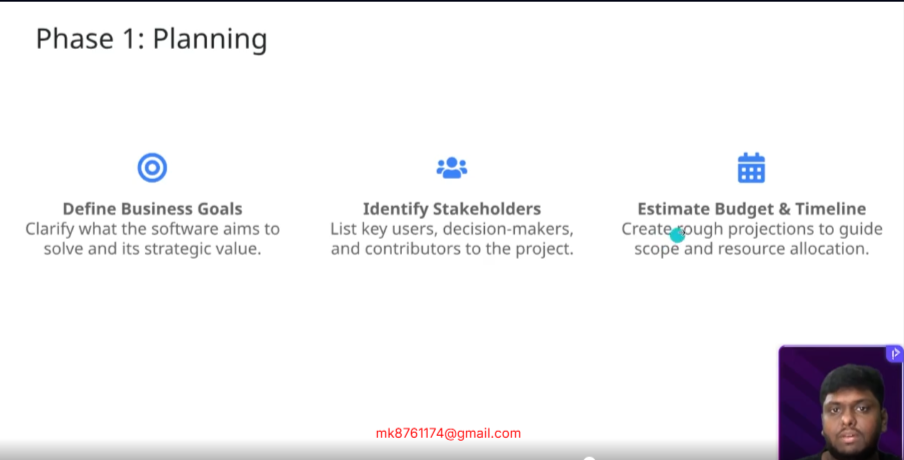
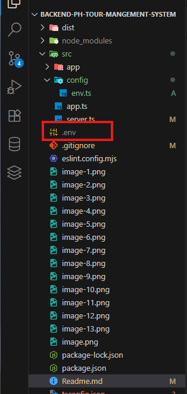
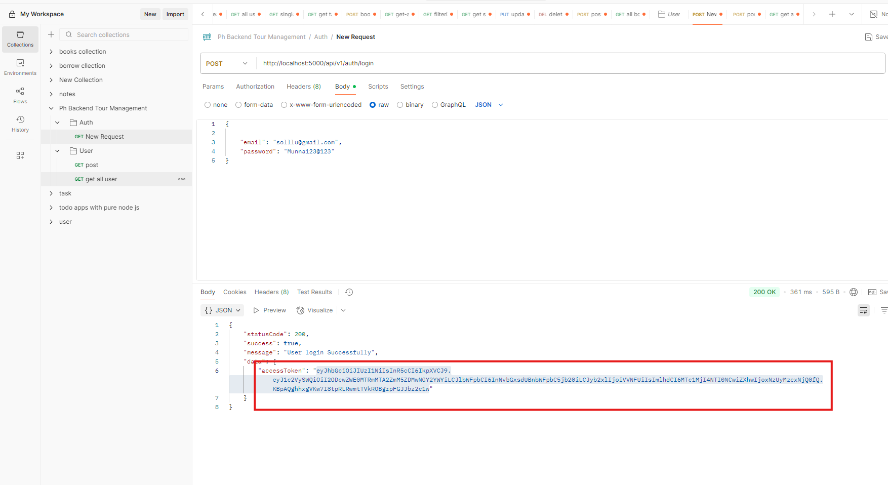

# Be-A-Industry-Standard-Maestro

Requirement Analysis - PH Tour Management System Backend

https://docs.google.com/document/d/1XRN18ClObPMJGKl7CfZFBLeZuJf2h8JOBc_crzuWtT4/edit?tab=t.0


Workflow of the PH Tour Management System 

https://gitmind.com/app/docs/mzkbj5o2


PH Tour Management System Data Modelling

https://docs.google.com/document/d/1NSELQ7_jUx4xLGchef4HT3_9YqDWrdzUUGMZWmD2lY0/edit?tab=t.0


ER Diagram for PH Tour Management System

https://drive.google.com/file/d/1ASphx7B6gHIKPiiiNf3AB_ZTvdYRBsQz/view?usp=sharing


PNG Format of ER Diagram for PH Tour Management System

https://drive.google.com/file/d/1KspyCQ992oAw1dDhIzRtK8-q5jnhWG0z/view?usp=drive_link


PH Tour Management System API Endpoints

https://docs.google.com/document/d/1HysoioRCpSsGpSz8JQZRGii9GNkpdx0pEX-zHP2p334/edit?tab=t.0


GitHub Repository

https://github.com/Apollo-Level2-Web-Dev/ph-tour-management-system-backend


Project Setup Branch

https://github.com/Apollo-Level2-Web-Dev/ph-tour-management-system-backend/tree/project-setup


Development Branch

https://github.com/Apollo-Level2-Web-Dev/ph-tour-management-system-backend/tree/development

## 25-1 What is SDLC, How we should start a Project

#### What is SDLC? 


- This means we will divide each and every works of a project 

- SDLC Increases project's maintainability, predictability and makes cost efficient.  



- Different models of sdlc 


1. **Waterfall :** Its like after all formalities end user will get the final project. From planning to deployment all are done in between. 
2. **Agile :** This is built based on mvp pattern. This means the necessary components or features are built and given to client then gradually approaching
3. **Spiral :** This works in agile style and all the risk factors are considered so that less improvements are required 
4. **V-Model :** This works in waterfall modal and it undergoes heavy testing so that less improvements are required 

#### What Model We Will Follow? 

- We will use agile hybrid model and whe will create MVP. 

#### Different Phases Of SDLC 


##### Phase-1 : Planning Phase 


##### Phase-2 : Requirement Analysis


##### Phase-3 : System Design 


##### Phase-4 : Development


##### Phase-5 : Testing Phase 


##### Phase-6 : Deployment 


##### Phase-7 : Maintenance  


#### How We Will Work?


## 25-2 Requirement Analysis of PH Tour Management System

[REQUIREMENT ANALYSIS OF PH TOUR](https://docs.google.com/document/d/18-PxR_7rhUsh1oyNc1TZ39aY837bxvzoz7XW-xn2ehk/edit?usp=sharing)


## 25-3 Workflow of PH Tour Management System

[Workflow](https://gitmind.com/app/docs/m0k204te)



## 25-4 Modelling Data for PH Tour Management System

[DATA-MODELING-PH-TOUR](https://docs.google.com/document/d/17LyBRqUM2FAgLNUzTpR6Ecq3clLwsoFhUQNLVBWpqDI/edit?usp=sharing)

## 25-5 How to Make ER Diagram for PH Tour Management System





[ERD](https://drive.google.com/file/d/1-63IaqNgZJfUDU34sk3IHX__raqn8CD1/view?usp=sharing)


## 25-6 Create API Endpoints for PH Tour Management System

[API ENDPOINTS](https://docs.google.com/document/d/1B_Qc6ocEB5eF7iAidmET1BxGwsdGdfVaP2raLGepYaY/edit?usp=sharing)
git


## 25-7 Setting Up Project with Required Dependencies

- Initialize Git 

```bash
git init 
```
- Create a development branch 

```bash 
git checkout -b development  
```
#### Project set up
```bash 
npm init -y 
```
```bash 
 npm i -D typescript
```
```bash 
tsc --init
```


```bash 
npm i express mongoose zod jsonwebtoken cors dotenv
```
```bash 
npm i -D ts-node-dev @types/express @types/cors @types/dotenv @types/jsonwebtoken
```
